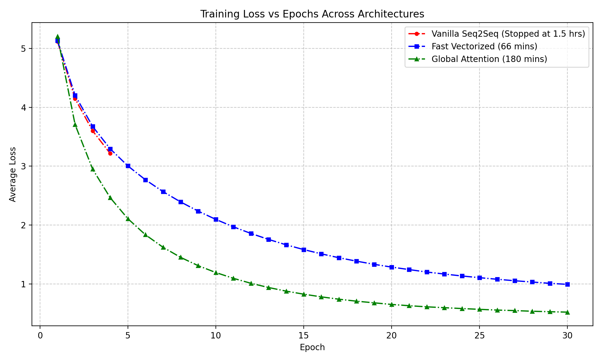

# English-to-Hindi Neural Machine Translation: From Vanilla Seq2Seq to Global Attention

An iterative machine learning engineering case study on building, scaling, and optimizing a Sequence-to-Sequence (Seq2Seq) neural machine translation model from scratch using TensorFlow and Keras.

This project translates English sentences into Hindi. It leverages a dataset of roughly 130,000 sentences and documents the architectural evolution required to overcome hardware bottlenecks (OOM errors, Graph Unrolling) and context degradation.

## 📈 Architectural Evolution & Optimization

Building this model was an exercise in scaling. We iterated through three distinct phases of architectural complexity to balance training speed with translation accuracy.



### Phase 1: The Vanilla Bottleneck (`Seq2Seq.ipynb`)
* **Architecture:** Standard Encoder-Decoder LSTM.
* **The Bottleneck:** The initial model used a dynamic autoregressive loop during training. This forced TensorFlow to bottleneck on standard CUDA cores by processing target sequences token-by-token.
* **Result:** Massive GPU starvation, extreme memory bloat, and an estimated epoch time of ~22.5 minutes (11+ hours total). The run was terminated early at Epoch 4.

### Phase 2: Vectorization & cuDNN Offloading (`Seq2Seq_Fast.ipynb`)
* **Architecture:** Vectorized Teacher Forcing.
* **The Fix:** We mathematically bypassed the slow loop by feeding the entire shifted target sequence into the LSTM simultaneously. This allowed NVIDIA's `cuDNN` library to natively delegate the massive matrix multiplications directly to the physical Tensor Cores.
* **Result:** Training time plummeted by over 90% (to ~2.2 minutes per epoch). 30 epochs completed in 66 minutes with a final loss of `0.9918`. However, without an attention mechanism, long-term context was lost, leading to hallucinated translations.

### Phase 3: Global Attention & Scaling (`Seq2Seq_Attention.ipynb`)
* **Architecture:** Luong Global Attention.
* **The Fix:** We implemented a strict text-cleaning pipeline (stripping punctuation and lowercasing) which allowed us to safely scale the vocabulary up to 20,000 words. We then introduced a Luong Global Attention layer to combat context degradation. Because Luong Attention calculates context *after* the LSTM step, we maintained our vectorized fast-path training speed.
* **Result:** 30 epochs completed in ~3 hours, yielding a vastly superior final loss of `0.5199`.

## 🧪 Inference Results & Performance

The Phase 3 Attention model demonstrated a strong grasp of Hindi syntax and vocabulary. 

**Successful Translations:**
* *English:* "where are you going" -> *Hindi:* "आप कहाँ जा रहे हैं" (Perfect)
* *English:* "i love you" -> *Hindi:* "तुमसे प्यार है।" (Perfect)
* *English:* "i am going home" -> *Hindi:* "मैं घर जाती हूं" (Perfect verb conjugation)

**Imperfections & Limitations:**
Despite the exceptionally low loss, the model still exhibits classic vanilla RNN limitations:
1. **Gender & Noun Disagreement:** Hindi has complex gendered grammar rules that depend on the subject. The model occasionally mixes masculine and feminine agreements (e.g., translating "this is a good book" as "यह एक अच्छा पुस्तक है" instead of using the feminine "अच्छी").
2. **Context Hallucination:** On longer, highly complex sentences outside of its immediate 130k-row training distribution, the decoder can occasionally lose the contextual thread, stitching together logically related but syntactically messy phrasing.
3. **Dataset Limits:** 130,000 sentences is relatively small for generalized neural machine translation. Extremely rare phrasing or idioms are often forced into `<UNK>` tokens or ignored by the embedding layer entirely.

## 🛠 Repository Structure & Usage

### Core Files
* `Seq2Seq.ipynb` - The baseline autoregressive model (Phase 1).
* `Seq2Seq_Fast.ipynb` - The optimized, fully vectorized cuDNN model (Phase 2).
* `Seq2Seq_Attention.ipynb` - The final model with text cleaning and Global Attention (Phase 3).
* `inference.py` - A universal, dynamic inference script for testing weights.

### 💾 Download Model Weights
Due to file size limits, the trained `.h5` model weights are not hosted directly in the source code repository. 
You can download the weights for all three phases from the **[v1.0.0 Release Page](https://github.com/AmanBanik/Moogle_Translate/releases/tag/v1.0.0)**. Place the `.h5` files in the root directory alongside `inference.py` before running tests.

### How to Run Inference
We provide a universal `inference.py` script. You do not need to rewrite code to test different sets of weights.

1. Open `inference.py`.
2. Locate the Configuration block at the very top of the file:
```python
# Put the name of your weights file here
WEIGHTS_PATH = "seq2seq_attention.weights.h5" 

# Set to True if testing the Attention model, False for the Vanilla/cuDNN model
USE_ATTENTION = True
```
3. Set `WEIGHTS_PATH` to point to your compiled `.h5` file.
4. Toggle `USE_ATTENTION` to `True` or `False` depending on which notebook generated the weights. The script will dynamically route execution to the correct neural architecture, vocabulary limits, and preprocessing pipelines to match.
5. Run the script:
```bash
python inference.py
```
